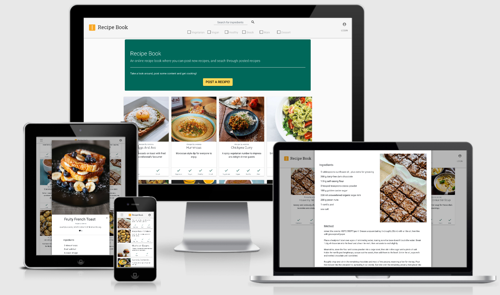

# Recipe Book

An online recipe book where users can find, upload, edit and delete recipes. Made with flask.



## Demo

A link to the project hosted on Heroku can be found [here](https://wrengit-recipebook.herokuapp.com)

## UX

The UX was designed to be as clean and clutter free as possible. From experience, often when a user is searching for a recipe online, sites were found to contain too much information, and made finding the ingredients list or method cumbersome. The Material design philosophy was followed, drawing inspiration from the card and paper styles.

The colour scheme was obtained from the Material.io colour-picker tool, using two complimentary, but contrasting colours.

When a user selects a recipe, they are not navigated away from the main page. Instead a large modal contains all required information. Recipe cards show a title, large image, short recipe description and tags to indicate the type of recipe.

A fixed navigation bar was chosen to ensure that users always had access to the tags filtering, to quickly locate a recipe that meets their needs. Recipes can also be searched over by ingredient(s), which also allow tag filtering.

## Wireframes

A link to the wireframe can be found [here](https://github.com/wrengit/milestone3/blob/master/wireframes/wireframes.md)

## Code

### Configuration file structure

The file structure is broken down to ensure each .py file serves a single purpose.

**wsgi.py**
Launches the application, and contains no other information aside the `app` import.
The app configuaration is saved in an object, `Config`, which imports the `SECRET_KEY` and `MONGO_URI` from the environment variables. This information is loaded into the settings on the Heroku app when deploying, as the EnvVar are not pushed to the git respository. Thie `Config` object also sets the `debug` value.

**errors.py**
Contains the routes to the HTTP 404 and 500 errors.

**forms.py**
Manages the form models created for Flask-wtf and Flask-login.

**users.py**
Adds a User model for Flask-login.

**view.py**
This file contains the majority of the routes used in the app. Comments are given above each route to explain the function and reasoning.

**__init.py__**
This file initialises the Flask application, and configures the app and it's modules. The `views.py`, `users.py`, and `errors.py` are imported here, after the app has been declared.

#### Comments

Whilst flask extensions, such as Flask-wtf and Flask-login, made integrating forms and a user management system easier, it often felt like I was fighting against them. Notable issues included support for using Flask-login with a NoSQL db being fairly absent.

Flask-login requires the use of a 'User' model, which uses a ORM/DRM to define the schema. I initially used MongoEngine as an ORM. Whilst trying to implement features, I found that MongoEngine was not active and not being worked on to update with the latest MongoDB updates.

I found the Flask-wtf and wtforms documentation very difficult to grasp, and found implementing custom widgets to render additional form areas and HTML classes too complicated. To work round this, the site uses JS to add buttons, classes, and change layouts after the page has initially loaded. This feels a bit 'hacky', and is noticeable to the end user when a form, particularly the edit/post recipe form, loads.

## DB Schema

MongoDB Atlas was chosen as the DB to allow change to be made the  DB schema in future, if upgrading or changing the site. The server is cloud based to ensure continuous uptime, and to allow the recipes to persist on Heroku, which periodically restarts their servers, removing any locally stored content.

There are two collection in the DB. These are the 'users' collection and the 'recipes' collection.

Schemas for the two collections can be found below.

`users`

```
{user
    {_id: unique objectId},
    {name: username},
    {email: user@email.com},
    {password: hashed password},
    {is_admin: Boolean}
}
```

`recipes`

```
{recipes
    {_id: unique objectId},
    {name: recipe name},
    {desc: recipe description},
    {ingredients [
        {ingredient string field},
        {ingredient string field},
        { ... }
        ]},
    {method: recipe method},
    {owner: recipe owner (username)},
    {tags [
        {tag},
        {tag},
        {tag}
    ]},
    {image: url to image location},
    {likes: [
        {username},
        {username},
        {username}
    ]}
}
```

## Features

### Existing Features

- Full text search of recipe ingredients

  Submitting the search field will search the DB recipes ingredients field for all matching words. Common words, such as 'and', 'of', etc are omitted from the search and will not return any results

- Filtering of recipes based on a selection of 'tags'

  The user is presented with 6 'tags' when posting a recipe. These allow filtering of the recipes to narrow down recipes that other users may or may not be interested in

- Favouriting, or liking a recipe to save to profile page for future reference

  This serves to show the popularity of a recipe to help users decide, as a form of peer review. This feature also gives content creators feedback on their content, inspiring them to post more

- Adding, editing and deleting of user recipes

  Users have full control over their recipes, with only the user able to edit or delete their own recipes

### Features Left to Implement

- Upgrade ingredient text search to rank results based on matching ingredients

   Currently the search will return all recipes that contain the search field. If a user searches for two ingredients (a + b), and recipe 1 contains a, whilst recipe 2 contains a + b, then the results should display recipe 2 first

- Add ability to sort recipes by 'like' rating

- Add ability to change user password, and potentially email user if password has been forgot

## Languages

- **Python**
- **JavaScript**
- **HTML**
- **CSS**

## Technologies Used

- [Pipenv](https://pipenv.readthedocs.io/en/latest/) - Package manager with virtual envs
- [Flask](https://flask.palletsprojects.com/en/1.1.x/) - Python web framework
- [MongoDB Atlas](https://www.mongodb.com/cloud/atlas) - Cloud based MongoDB server
- [PyMongo](https://api.mongodb.com/python/current/) - Tools for working with MongoDb from Flask
- [Flask-wtf](https://flask-wtf.readthedocs.io/en/stable/) - Integration of Flask and WTForms
- [Flask-login](https://flask-login.readthedocs.io/en/latest/) - User session management for Flask
- [Gunicorn](https://gunicorn.org/) - WSGI HTTP server
- [Bootstrap MD](https://fezvrasta.github.io/bootstrap-material-design/) - Material Design by fezvrasta
- [Bootstrap](https://getbootstrap.com/) - Frontend component library
- [PopperJS](https://popper.js.org/) - Tooltip and popover library
- [jQuery](https://jquery.com/) - DOM manipulation library

## Services Used

- [Compress or Die](https://compress-or-die.com/) - amazing image compression tool
- [Unsplash](https://unsplash.com/) - image repository
- [favicon.io](https://favicon.io/) - favicon & logo generator
- [Material color tool](https://material.io/resources/color/#!/?view.left=0&view.right=0) - Material design colour picker
- [Material Icons](https://material.io/resources/icons/?style=baseline) - Material design Icons from Google
- [Font Awesome](https://fontawesome.com/) - Huge selection of icons
- [Google Fonts](https://fonts.google.com/) - Fonts by Google

## Testing

The site was tested with W3 HTML & CSS validators.

Friends and family were recruited as users, and encouraged to use the site and report any issues.

### Functionality

All links were tested, along with ensuring that forms filled successfully. Error testing was conducted to ensure the correct error fires, and gives suitable feedback to the user.
HTML/CSS was validated.

### Usability

Feedback was received from my tutor, Sindhu, and from friends and family regarding specific usability issues. When brought up, improvements were made to make using the site clearer and more consistent.
The site text was passed to a spell checker, and to an accessibility [checker](https://wave.webaim.org/) to highlight contrast errors, ensure correct labels and titles, or small type fonts.

#### Interface

Errors were tested by intentionally entering incorrect information into the URL string, and passing bad information to the API.

### Compatibility

The site was developed on a Dell XPS 13 13" 2-in-1 touch screen laptop. Initial testing was conducted with Brave Browser, Microsoft Edge, and Chrome. Mobile testing used a Huawei P20 pro, using Brave, Chrome, and Firefox. There was no availability of Apple devices, either mobile or desktop to conduct testing.

All testing was conducted manually.

Screen sizes were testing using the browser devtools, and tested down to iPhone 5 size to ensure the site stayed responsive.

#### Security

The site has been designed defensively, such that a user may not access any part of the page with out the proper verification. All CRUD operations to the DB were tested to ensure that editing url strings, and retrieving information (such as objectId's from the source code) could not be used to defeat the security measures.

### Issues

Occasionally, on mobile devices, the recipe card images slightly change width, or sequentially get narrower down the view. Refreshing the view resets the images to their proper size. This has not been able to be reliably produced, and so the cause is not determined.

### User stories

> As a user I want to be able to quickly and easily search for a recipe based on specified criteria (ingredients, vegetarian, etc)
>
> > The user can search for recipes based on included ingredients, and/or filter recipes by a series of tags to narrow down the right recipe. This is easily done, with the search and tags section prominently displayed at the top of the page, or in the navbar toggle menu on mobiles
---
> As a user I would like to be able to save or like recipes, so I can revisit them quickly next time I visit the site
>
> > The user may open a recipe, and if logged in, can like or favourite the recipe. The list of liked recipes can be found in the profile section for a user to quickly locate on return to the page
---
> As a user I want to post and share my own recipes for others to use. Getting 'likes' on my recipes would encourage me to post more
>
> > The user can post a recipe, once logged in, and the ability to do so is clearly shown on the jumbotron on the index/home page. Users can see how many likes their recipe has received, which ensures that they contribute further to the site, and gives sense that other users are enjoying their content
---
> As a user I want to delete or edit my posted recipes, if I no longer wish them to be online, or have decided to change the method or ingredients
>
> > The user is able to easily edit or delete a recipe that they own, from within the recipe modal. This information is presented clearly at the bottom of the modal. Editing a recipe is easy, with the form prepopulated with the existing recipe information. To delete a recipe, the site will ask the user to confirm that they want to delete the recipe. This is to ensure a misplaced click does not delete content unnecessarily.

### Accessibility

The site was passed to the WAVE accessibility checker to ensure ARIA labels were in place, and to increase the contrast on hard to view elements.

## Cloning & Deployment

### Cloning

The site can be cloned to a local repository by the following steps (GitHub guide link [here](https://help.github.com/en/articles/cloning-a-repository)):

- Under the repository name, click Clone or download.

- In the Clone with HTTPs section, click the clipboard icon to copy the clone URL for the repository.

- Open the terminal on your local machine

- Change the current working directory to the location where you want the cloned directory to be made.

- Type `git clone`, and then paste the URL you previously copied.

\$ git clone https://github.com/YOUR-USERNAME/YOUR-REPOSITORY

- Press Enter. Your local clone will be created.

```Bash

> Cloning into `Spoon-Knife`...
> remote: Counting objects: 10, done.
> remote: Compressing objects: 100% (8/8), done.
> remove: Total 10 (delta 1), reused 10 (delta 1)
> Unpacking objects: 100% (10/10), done.

```

### Deployment

The site is deployed on Heroku, on the free tier. This has limited dynos and is intended to simply show the site functioning. This free tier is not for production ready use.

Log into Heroku navigate to the dashboard. Here in the top right, select the 'New' button, and navigate to 'Create new app'. Name the app and select a server. Select the app on the dashboard and find the 'deploy' button on the top navigating bar. At the bottom of the deploy section there is the option to link your app to a GitHub repository.

The site is deployed by linking the main GitHub repository master branch to Heroku. The environment variables are entered on the app settings. These include the MONGO_URI, and flask SECRET_KEY.

Further information detailing alternative methods to deploy to Heroku can be found on the official Heroku documentation [here](https://devcenter.heroku.com/categories/deployment)

## Credits

### Guides and resources

Comments in the code detail where code snippets have been used, often from Stack Overflow. URL links have been provided to the original content to compare.

Special credit goes to Miguel Grinberg. The 'flask mega tutorial' blog series ([found here](https://blog.miguelgrinberg.com/post/the-flask-mega-tutorial-part-i-hello-world)) was invaluable in teaching me the intricacies of flask, and its capabilities.

Without this resource I would have struggled to build this web app (Recipe Book). While every endeavorer was made to write my own python for this app, there will inevitably be some similarities in the code. If I encountered a problem, I initially tried to find a solution through web searches, before turning back to the flask mega tutorial for further guidance.
The file separation and structure were heavily influenced by Miguel Grinberg.

### Content

All code is written by me (wrenna). Recipes and user content are by me, friends, family and other users.

### Media

Recipe images (by wrenna) are from [Unsplash](http://unsplash.com), a royalty free, free to use image repository. Photographer credits for the images are below. Users have the ability to link to web images.

- [Hannah Pemberton](https://unsplash.com/@thekitchenalchemist)
- [The Creative Exchange](https://unsplash.com/@creativeexchange)
- [sheri silver](https://unsplash.com/@sheri_silver)
- [Edgar Castrejon](https://unsplash.com/@edgarraw)
- [Alana Haris](https://unsplash.com/@alanaharris)
- [Michelle Tsang](https://unsplash.com/@petitesweetsnz)
- [Eiliv-Sonas Aceron](https://unsplash.com/@shootdelicious)
- [Ben Kolde](https://unsplash.com/@benkolde)
- [Eaters Collective](https://unsplash.com/@eaterscollective)
- [Taylor Kiser](https://unsplash.com/@foodfaithfit)
- [Joseph Gonzales](https://unsplash.com/@miracletwentyone)
- [Monika Grabkowska](https://unsplash.com/@moniqa)
- [Lukas Blazek](https://unsplash.com/@goumbik)
