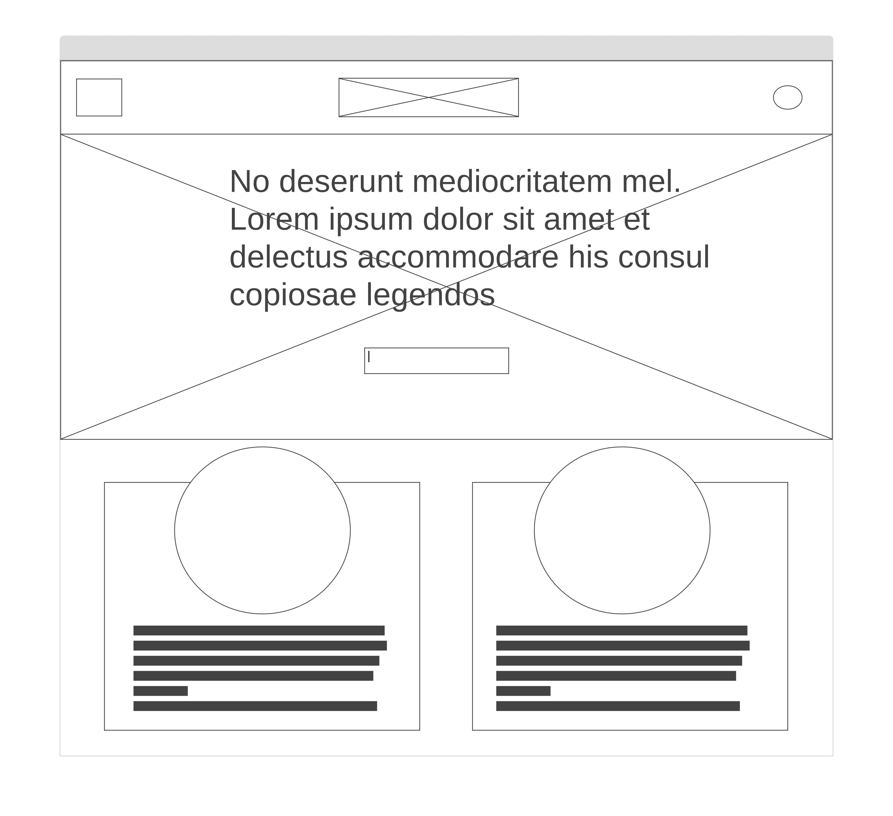
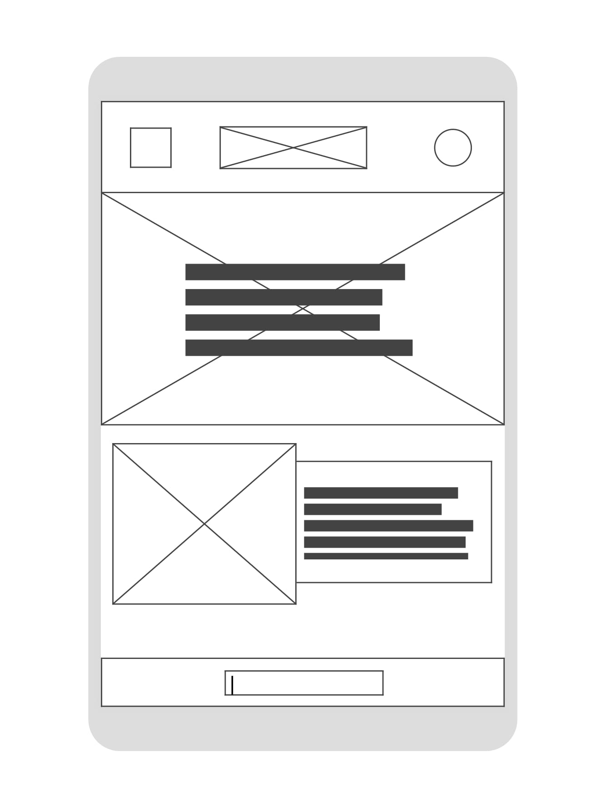
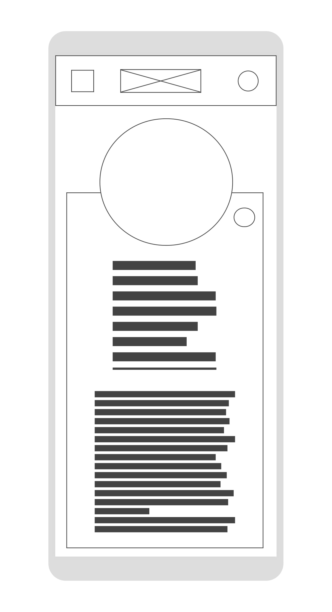

# Wireframes for Recipe Book

## Main home/index page

### Desktop view

A central jumbotron will display information about the page. A search box will be included in the jumbotron. Recipe cards to be displayed with a large recipe image and recipe information. A profile link will be found in the top right hand corner.

A full screen modal will open when recipe is selected, displaying extended information about the recipe, including ingrediets and method.

### Mobile view

Similar to the desktop view, a Jumbo tron will display page information. A search box will be included in the jumbotron, or in the dropdown menu.

Upon selecting a recipe, a full screen modal will show additional recipe information.

## Profile page

### Desktop view 

A jumbotron will display page information, tailoring the content to the user. This page will show owned recipes and liked recipes to the user. Layout will be very similar to the main index page.

### Mobile view

Similar to the desktop view, recipe cards will be displayed with minimal information. Profile page will be tailored to the user with liked and owned recipes.